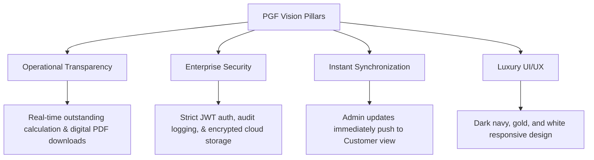

# 01. Vision & Goals

---

## 1. Executive Summary

### 1.1 Context & Market Need
Gold loans (or pawn broking) represent one of the oldest and most resilient forms of secured lending. However, the traditional gold loan sector suffers from significant operational inefficiencies:
* **Information Asymmetry**: Customers must physically visit branches or make phone calls to check outstanding balances, interest rates, and due dates.
* **Manual Tracking**: Paper ledgers or legacy desktop systems lead to double-entry errors, administrative bottlenecks, and slow processing times.
* **Proactive Risk Management**: Lack of automated reminders results in high default rates or delayed interest payments, eroding profit margins.

**Pavithra Gold Finance (PGF)** is an enterprise-grade digital solution designed specifically to address these challenges for a single-business, single-branch gold loan entity. PGF bridges the gap by providing the business owner (Admin) with an automated backend to manage clients, gold assets, and loans, while empowering the borrower (Customer) with a luxury dashboard showcasing their collateral, interest accrued, and payment history in real time.

### 1.2 System Objectives
The core objective of PGF is to establish a secure, lightning-fast digital platform that automates loan tracking, calculates interest dynamically, and synchronizes data instantly between the business owner and the borrower. 
* **For the Admin**: A robust control panel that handles customer onboarding, gold appraisals, loan creation, interest rate configuration, secure document storage, and immediate synchronization of updates.
* **For the Customer**: An elegant, secure mobile-responsive customer portal that serves as a transparent window into their active loans, itemized gold details, and history of payments.

---

## 2. Product Vision

### 2.1 The Vision Statement
*“To elevate the gold loan experience from a transaction of necessity to a premium, transparent, and modern financial partnership.”*

PGF envisions a platform where trust is built through transparent data sharing. By replacing static, physical receipts with dynamic, downloadable digital PDFs, and automating reminders via WhatsApp, SMS, and Push Notifications, PGF will redefine local gold finance operations. The user interface will reflect the design standards of premium Swiss private banking applications—minimal, luxurious, and highly professional.

### 2.2 Product Pillars

* **Operational Transparency**: Customers can see exactly how their interest accumulates daily, eliminating dispute vectors and establishing high-trust relationships.
* **Enterprise-Grade Security**: Protecting physical gold collateral requires equivalent digital security. PGF ensures strict validation, encrypted storage of digital signatures/photos, and detailed audit trails.
* **Instant Synchronization**: Any modification made by the Admin (e.g., payment logged, interest adjusted, gold appraised) is propagated instantly to the customer's portal via real-time WebSocket state management and server-side cache updates.
* **Luxury UI/UX**: The application departs from typical industrial-looking databases, utilizing a sophisticated palette (Dark Navy, Rich Gold, and Crisp White) paired with modern layout principles to evoke prestige and security.

---

## 3. Business Goals

The strategic goals of Pavithra Gold Finance are grouped into three key dimensions: Operational, Financial, and Customer Experience.

| Goal ID | Dimension | Metric / Target | Description |
|---|---|---|---|
| **BG-01** | Operational | **100% Paperless Auditing** | Eliminate physical paper folders for storage. All photos of gold assets, customer profiles, signatures, and signed loan documents must reside securely in Cloud Storage. |
| **BG-02** | Operational | **Zero Interest-Dispute Cases** | All interest accruals are calculated using a transparent, standardized formula visible to the customer daily. |
| **BG-03** | Financial | **40% Reduction in Delinquency** | Automated multi-channel notifications (30d, 15d, 7d, 3d, 1d, due date, overdue) targeting customers to minimize missed interest payments. |
| **BG-04** | Experience | **95% Self-Service Information** | Customers should not need to call the business to ask about active loans, outstanding amounts, or payment history. All data must be accessible via their Dashboard. |
| **BG-05** | Security | **Zero Unauthorized Data Access** | Single-business database isolation with robust JWT verification and full tamper-proof audit trails for all Admin activities. |

---

## 4. Target Users

Pavithra Gold Finance operates under a strict **Two-Role Model**. The roles are designed with clean division of privileges:

### 4.1 Admin (Business Owner / Branch Manager)
* **Demographics**: Business owners, appraisers, and lead managers.
* **Core Responsibilities**: 
  * Onboarding new customers (capturing photos, ID verification, signatures).
  * Gold valuation and appraisal (recording weight in grams, purity in karats, and taking high-resolution photos of gold ornaments).
  * Generating loans, defining custom or default interest rates, logging payments.
  * Triggering manual notifications, exporting financial PDF reports, and auditing logs.
* **Technical Proficiency**: Moderate. Requires a dashboard that is clean, highly visible, fast to operate on desktop monitors, and structured to prevent input errors (e.g., mistyping gram values).

### 4.2 Customer (Borrower)
* **Demographics**: Individuals seeking immediate liquidity against gold collateral.
* **Core Responsibilities**: 
  * Tracking active loans, outstanding amounts, interest rates, and upcoming due dates.
  * Viewing detailed item specifications of their pawned gold, including structural photographs.
  * Downloading digital PDF copies of signed agreements and payment receipts.
  * Receiving alerts via push notifications, WhatsApp, and SMS.
* **Technical Proficiency**: Low to High. The portal must be optimized primarily for mobile browsers, featuring extremely legible typography, direct access to action buttons, and zero clutter.
