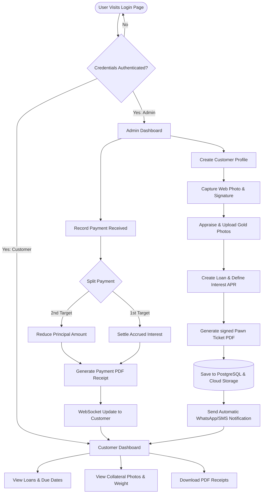

# 03. User & Navigation Flows

---

## 9. Complete User Flow

The complete system workflow defines how the backend logic, databases, and user actions interact during the lifecycle of a loan.



---

## 10. Navigation Flow

Both roles enter the application through a **Single Unified Login Screen**. Based on the claims contained in the signed JWT payload, users are routed automatically to their respective entry dashboards.

### 10.1 Login & Routing Flow
```
                     [Unified Login Screen]
                               │
                       (Authenticate Credentials)
                               │
            ┌──────────────────┴──────────────────┐
            ▼                                     ▼
     Role = 'Admin'                      Role = 'Customer'
            │                                     │
    [Admin Dashboard]                   [Customer Dashboard]
```

### 10.2 Admin Navigation Paths
* **Dashboard** (Metric summary, quick-search toolbar)
* **Customer Management**
  * `List View` ➔ `Customer Detail Profile` ➔ `Upload Signature/Webcam`
* **Gold Management**
  * `Appraisal Panel` ➔ `Weight, Purity Input` ➔ `Upload Collateral Photos`
* **Loan Management**
  * `Loan List` ➔ `Origination Wizard` ➔ `Interest Rates & Penalties` ➔ `Download Pawn Ticket`
* **Payment Management**
  * `Record Transaction` ➔ `Payment Ledger` ➔ `Export Receipts`
* **Notifications Control Panel**
  * `Notification Logs` ➔ `Template Configurator` ➔ `SMS/WhatsApp Dispatcher`
* **Audit Logs & Settings**
  * `System Activity Log` ➔ `Security Policies`

### 10.3 Customer Navigation Paths (Mobile-First)
* **Dashboard** (Summary card: Total Active Loans, Outstanding, Next Due Date)
* **Active Loans Screen**
  * `Select Loan` ➔ `Interest Accrued Card` ➔ `Terms (APR/Duration)`
* **Collateral Details Screen**
  * `Image Slider` ➔ `Item Specifications (Grams/Karat)`
* **Payment Receipts Archive**
  * `Payment List` ➔ `Download PDF Receipt`
* **Profile Settings**
  * `Contact Verification` ➔ `Reset Password`

---

## 11. Screen Hierarchy

Below is the directory/routing architecture of the Next.js application showing how files correspond to individual layouts and views.

```
/app
├── layout.tsx                    # Global styling & layout wrapper
├── page.tsx                      # Unified Login Screen
├── forbidden/                    # 403 Access Denied page
│
├── (admin)/                      # Admin Portal Route Group
│   ├── layout.tsx                # Admin sidebar navigation layout
│   ├── dashboard/
│   │   └── page.tsx              # Admin Dashboard view
│   ├── customers/
│   │   ├── page.tsx              # Customer list & search
│   │   └── [id]/
│   │       └── page.tsx          # Customer profile view & onboarding media
│   ├── loans/
│   │   ├── page.tsx              # Active/defaulted loans table
│   │   ├── new/
│   │   │   └── page.tsx          # Loan origination form wizard
│   │   └── [id]/
│   │       └── page.tsx          # Loan details and repayment actions
│   ├── payments/
│   │   └── page.tsx              # Global payment list & export panel
│   ├── notifications/
│   │   └── page.tsx              # Notifications tracking and log
│   └── settings/
│       └── page.tsx              # Global APR configurations and audit logs
│
└── (customer)/                   # Customer Portal Route Group (Mobile Optimized)
    ├── layout.tsx                # Customer bottom-navigation layout
    ├── dashboard/
    │   └── page.tsx              # Customer Dashboard view (Balance card)
    ├── loans/
    │   ├── page.tsx              # Active loan records list
    │   └── [id]/
    │       └── page.tsx          # Loan balance, interest breakdown, & gold details
    ├── payments/
    │   └── page.tsx              # Payment history list & PDF download button
    └── profile/
        └── page.tsx              # Customer profile information
```
