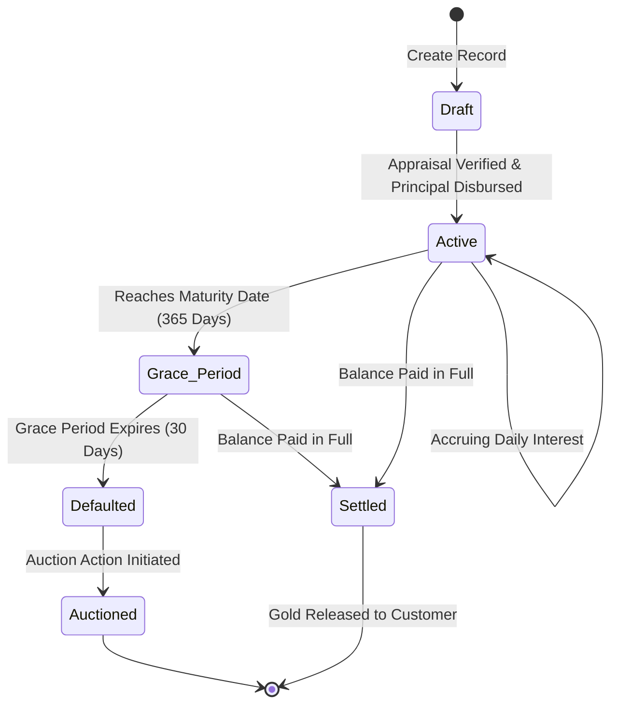

# 06. Business Workflows

---

## 21. Customer Workflow
1. **Onboarding Invite**: Upon being created by the Admin, the Customer receives an automated SMS and WhatsApp link containing their user profile details and temporary login credentials.
2. **Accessing Portal**: The Customer logs in, immediately sets a secure custom password, and accepts the platform Terms and Conditions.
3. **Active Monitoring**: The Customer uses the interface to check daily interest accumulation, track payment deadlines, and verify the weight/karat specifications of their pawned ornaments.
4. **Document Archiving**: Whenever they need records for legal or personal reference, the Customer opens the payments tab and exports PDF receipts.

---

## 22. Admin Workflow
1. **Branch Operation Startup**: The Admin logs in at the beginning of the business day. The dashboard presents total outstanding balances and a list of overdue collections.
2. **Customer Registration & Appraisal**: 
   * Onboards new clients with ID uploads and webcam captures.
   * Weighs collateral, records specifications, and inputs items.
3. **Loan Lifecycle Execution**: Sets terms, signs agreements, issues funds, logs interest receipts, and processes gold releases upon maturity.
4. **Administrative Controls**: Reviews system audit logs and configures base interest parameters.

---

## 23. Loan Workflow



### 23.1 Detailed Lifecycle States
* **Draft**: The loan is generated in the system but funds are not yet released.
* **Active**: Funds have been disbursed. Interest begins accruing on a daily basis.
* **Grace Period**: The loan has hit its 1-year maturity, but is granted an additional 30-day cushion to settle before being classified as Defaulted.
* **Defaulted**: Non-payment after the grace period. Legal collections processing starts.
* **Auctioned**: Collateral gold is sold to recover outstanding principal and interest balances.
* **Settled**: Outstanding balance is reduced to zero. Gold is cleared for release.

---

## 24. Gold Management Workflow
1. **Item Intake**: The physical gold is received by the appraiser.
2. **Appraisal & Valuation**:
   * Gold weight is checked using calibrated analytical balances (recorded to 2 decimal places).
   * Purity check via acid testing or spectrometer (recorded as 18K, 22K, or 24K).
   * Estimated value calculated as: $\text{Weight (grams)} \times \text{Purity Ratio} \times \text{Current Gold Market Price per Gram}$.
3. **Webcam Capture**: Admin takes high-resolution close-ups of all ornaments to verify item condition.
4. **Securing Asset**: The item is sealed in a tamper-proof envelope, registered with a unique barcoded storage bin ID, and placed in the main branch vault.
5. **Audits & Inventory Checks**: Regular digital balance sheets verify that every active loan correlates to a matching item physically secured in a vault locker.
6. **Asset Release**: Upon loan settlement, the Admin retrieves the gold packet, checks the envelope seals in front of the customer, and captures the customer's signature confirming retrieval.

---

## 25. Payment Workflow
Every transaction logged in the system must follow strict accounting and allocation logic:

$$\text{Payment Received} \rightarrow \text{Apply to Accrued Interest First} \rightarrow \text{Apply Remainder to Principal}$$

### 25.1 Accrued Interest Formula (Simple Interest Accrued Daily)
Daily interest accrued is computed as:

$$\text{Daily Accrual} = \frac{\text{Principal} \times \left(\frac{\text{Annual Interest Rate (APR)}}{100}\right)}{365}$$

### 25.2 Allocation Execution Steps
1. Customer pays $P$ Rupees.
2. Calculate total accrued interest $I_A$ since the last payment or origination date.
3. If $P \ge I_A$:
   * Interest Paid = $I_A$.
   * Principal Reduction = $P - I_A$.
   * New Principal = $\text{Current Principal} - (\text{Principal Reduction})$.
4. If $P < I_A$:
   * Interest Paid = $P$.
   * Principal Reduction = $0$.
   * Remaining Accrued Interest = $I_A - P$.
5. The database state is updated, and a new amortization record is generated.

---

## 26. Notification Workflow
PGF uses an automated multi-channel messaging system to maintain high borrower responsiveness.

### 26.1 Notification Matrix
| Event Trigger | Target Channels | Template |
|---|---|---|
| **Loan Origination** | SMS, WhatsApp | *"Hello [Name], your loan [LoanID] for [Amount] is active. Access your digital ticket at [Link]."* |
| **Maturity Warning (30d)** | SMS, WhatsApp, Push | *"Hello [Name], loan [LoanID] matures in 30 days. Current outstanding: [Amount]."* |
| **Urgent Alert (3d)** | SMS, WhatsApp, Push | *"URGENT: Your gold loan [LoanID] matures in 3 days. Please pay to avoid penalties."* |
| **Due Date Action** | WhatsApp, SMS, Push | *"Today is the due date for [LoanID]. Total balance due: [Amount]."* |
| **Payment Logged** | SMS, WhatsApp | *"Payment of [Amount] received. Remaining Principal: [Bal]. Thank you."* |

---

## 27. PDF Generation Workflow
All document generation is processed server-side to guarantee format security and legal compliance.

```
[Request Doc Generation] ➔ [Fetch DB Data] ➔ [Compile HTML Template] ➔ [Render to PDF via Puppeteer/PDFKit] ➔ [Save to Cloud Storage] ➔ [Return Download URL]
```

### 27.1 Digital Pawn Ticket PDF Requirements
* **Header**: Brand Logo, Registered Business License details, Address, Contact numbers.
* **Body Section 1**: Customer Profile (Name, Address, Aadhaar Number, Photo, Digital Signature).
* **Body Section 2**: Collateral Table (Description, Grams, Purity, Appraiser Notes, Gold Photos).
* **Body Section 3**: Financial terms (Principal, APR, Accrual terms, Maturity Date).
* **Footer**: Legal terms and conditions, pawnbroker signature, borrower pledge signature.

---

## 28. Security Workflow
PGF enforces strict zero-trust boundary isolation:
1. **Request Interception**: Every incoming API request passes through a backend middleware verification layer.
2. **JWT Checking**: Extract the token from cookies. Verify signature against server private keys.
3. **Role Validation**: If an endpoint has an `@AdminOnly` decorator, check payload claims. If `role !== 'Admin'`, block execution and log a severity warning.
4. **Session Timeout**: JWT expirations force clean logout states to prevent session hijacking.
